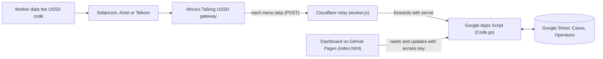

# Justicore: setup and go-live guide

This repository contains a working starter build of Justicore. When it is set up, a worker who dials the USSD code creates a case that appears on the case officer dashboard within a minute, and a case officer's updates are what the worker hears when they dial back to check their case. The guide takes the build from nothing to a working test service, then to a live code on the Kenyan networks. It sets out the data protection work that has to be completed before any real report is received.

## 1. How the pieces fit



| Component | Where it runs | What it does | Cost |
|---|---|---|---|
| `apps-script/Code.gs` | Google Apps Script, attached to a Google Sheet | Holds the USSD menu, writes cases to the sheet, serves the dashboard | Free |
| `relay/worker.js` | Cloudflare Workers | Receives USSD traffic from Africa's Talking and passes it to Apps Script | Free tier (100,000 requests a day) |
| `dashboard/index.html` | GitHub Pages | The case officer console | Free on a public repository |
| USSD code | Africa's Talking | Connects the mobile networks to the relay | Free in the sandbox; paid once live (Part 7) |

The relay is needed for a technical reason. Africa's Talking expects the next USSD screen in the direct reply to each request. A Google Apps Script web app replies to every POST with a redirect, so Apps Script cannot safely be the callback address itself. The relay follows the redirect and returns the screen text. It is a single short file and needs no maintenance.

You will need four accounts: a Google account (preferably a Google Workspace account belonging to the organisation), a free Cloudflare account, a free GitHub account, and an Africa's Talking account.

## 2. Build the backend (Google Sheet and Apps Script)

1. Create a new Google Sheet named **Justicore Case Register**. Use an organisational account, not a personal Gmail address.
2. In the sheet, open **Extensions > Apps Script**. Delete the sample code in `Code.gs`, paste in the full contents of `apps-script/Code.gs` from this repository, and save.
3. In the function selector at the top of the editor, choose **setup** and click **Run**. Google will ask for authorisation. Because the script is your own and unverified, Google shows a warning; choose **Advanced**, then **Go to project**, then **Allow**.
4. Open the **Execution log**. It shows two keys: `RELAY_SECRET` and `API_KEY`. Copy both into a password manager. They can be viewed again at any time under **Project Settings > Script properties**.
5. Return to the sheet. It now has a **Cases** tab and an **Operators** tab. The Operators tab contains fictional sample estates. Replace them with the real estates and factories you will work with. Put the six with the most workers first, because the USSD menu lists the first six by number and offers "Other" for anything else. Keep each `shortName` to 14 characters or fewer, and give each operator a short unique `id` without spaces.
6. Optionally, choose **testUssd** in the function selector and run it. The log prints each USSD screen, so you can read the whole menu without a phone.
7. Deploy the script as a web app: **Deploy > New deployment**, click the gear icon and choose **Web app**. Set **Execute as: Me** and **Who has access: Anyone**, then click **Deploy**. Copy the **Web app URL**, which ends in `/exec`.
8. Check that it works: open the web app URL in a browser with `?key=` and your API_KEY added at the end. You should see a JSON response beginning `{"ok":true`.

"Anyone" means anyone who holds the URL can reach the script, but every request is refused unless it carries the correct secret key. This is adequate for a pilot; Part 8 explains what to put in place before scaling up.

**Every time you change `Code.gs`**, publish the change through **Deploy > Manage deployments**, click the pencil icon, set **Version** to **New version**, and click **Deploy**. This keeps the same URL. Creating a new deployment instead produces a new URL, and the relay and dashboard would then need updating.

## 3. Build the relay (Cloudflare Worker)

1. Sign up at [dash.cloudflare.com](https://dash.cloudflare.com). No card is needed for the free tier.
2. Go to **Workers & Pages > Create > Create Worker**, name it `justicore-ussd`, and click **Deploy**.
3. Click **Edit code**, replace the contents with `relay/worker.js` from this repository, and click **Deploy**.
4. Open the worker's **Settings > Variables and Secrets** and add two entries:
   1. `APPS_SCRIPT_URL`, type **Text**, value: the web app URL from step 2.7.
   2. `RELAY_SECRET`, type **Secret**, value: the RELAY_SECRET from step 2.4.

   Save and deploy.
5. Copy the worker address, which has the form `https://justicore-ussd.<your-subdomain>.workers.dev`. Opening it in a browser should show "Justicore USSD relay is running."
6. Test the full chain from any terminal:

   ```bash
   curl -X POST https://justicore-ussd.<your-subdomain>.workers.dev \
     -d "sessionId=test-1" -d "serviceCode=*384*1234#" -d "phoneNumber=+254700000000" -d "text="
   ```

   The reply should be the main menu, beginning `CON Justicore`.

## 4. Connect a test USSD code (Africa's Talking sandbox)

The sandbox is free and lets you test the whole service with a simulated phone.

1. Create an account at [africastalking.com](https://africastalking.com) and open the **Sandbox** app.
2. Go to **USSD > Create channel**. Choose an available channel number under the shared sandbox code. Africa's Talking shows the resulting code, for example `*384*1234#`.
3. As the **Callback URL**, enter the Cloudflare worker address from step 3.5, then save.
4. Open the **Simulator** from the sandbox. Enter a Kenyan test number, choose USSD, dial your sandbox code, and work through a report.
5. Open the Google Sheet. The report appears as a new row in the Cases tab, with a reference such as `JC-26-1001`.
6. Dial again, choose **2. Check my case**, and enter the digits at the end of the reference (`1001`). The status from the sheet is read back to you.

Replace `*384*2025#` in the dashboard's Worker channel view with your own code. The code is used by `handleUssd_` in `Code.gs` automatically, because Africa's Talking sends it with every request.

## 5. Publish the dashboard (GitHub Pages)

1. Sign in to [github.com](https://github.com) and create a new repository named `justicore`. Make it **public**, because GitHub Pages is free only for public repositories. Neither the dashboard file nor the repository contains any case data or keys; data reaches the page only after an officer enters the access key.
2. Upload the contents of this starter folder: **Add file > Upload files**, drag in `README.md` and the `apps-script`, `relay` and `dashboard` folders, and commit.
3. Open `dashboard/index.html` in GitHub, click the pencil icon, and find the **CONFIGURATION** block near the top of the script:

   ```js
   const CONFIG = {
     API_URL: '',               // Apps Script web app URL ending in /exec
     OFFICER: 'Case officer',   // name recorded against notes and updates
     REFRESH_SECONDS: 60,
   };
   ```

   Paste the web app URL from step 2.7 between the quotes of `API_URL`, and commit. With `API_URL` left empty, the page shows the fictional sample data, which is useful for demonstrations.
4. Go to **Settings > Pages**. Under **Build and deployment**, set **Source** to **Deploy from a branch**, choose **main** and **/ (root)**, and save. After a minute or two the dashboard is available at `https://<your-username>.github.io/justicore/dashboard/`.
5. Open that address. The dashboard asks for the access key; enter the API_KEY from step 2.4. The browser remembers the key until it is cleared.
6. The sync indicator in the top bar shows **Live** and the time of the last update. The dashboard reloads every 60 seconds.

## 6. End-to-end check

Work through these checks in order. Each one proves a link in the chain.

| Check | Expected result |
|---|---|
| Simulator: report anonymously, choose "Yes, I can continue", pick a category and an operator | END screen with a reference; new row in the sheet with an empty `phone` cell |
| Simulator: report with "I need help now" and "Yes, call me" | Urgent case; `phone` kept and `callbackConsent` set to yes; red count on the dashboard's Cases menu and bell |
| Dashboard: open the urgent case, click **Record first contact** | Status changes to Triaged; `contactAt` filled in the sheet |
| Dashboard: refer a case and click **Save changes** | `partner`, `referredAt` and `status` updated in the sheet |
| Simulator: check that case by its number | Status reads "Referred for support" |
| Dashboard: **Log hotline call** | New case with channel `hotline` in the sheet |

## 7. Go live on the mobile networks

1. **Choose the code type.** A shared code is a channel under an Africa's Talking parent code (for example `*384*1234#`). It is quick to obtain and suits a pilot. A dedicated code (for example `*123#`) is easier for workers to remember, but it takes weeks to provision and costs substantially more.
2. **Budget.** Africa's Talking publishes the following dedicated code charges for Kenya, VAT inclusive: Safaricom, KES 145,000 setup (3 to 4 weeks) and KES 70,000 a month; Airtel, KES 116,000 setup (2 weeks) and KES 46,400 a month; Telkom, KES 58,000 setup and KES 116,000 a month; plus a one-time deposit of KES 28,500. A third-party 2026 guide puts a shared channel at about KES 5,000 setup and KES 3,000 a month; confirm the current shared code rate with Africa's Talking (ussd@africastalking.com) before budgeting. Per-session charges are additional.
3. **Settle who pays for the session.** By default a USSD session may be charged to the person dialling. The platform's promise that reporting costs the worker nothing depends on arranging with Africa's Talking for sessions to be free to the caller. Confirm this in writing before launch, because a charge on the worker's airtime is a real deterrent to reporting.
4. **Create the live app.** In Africa's Talking, create a live (non-sandbox) app, complete the business verification, top up the wallet, and apply for the USSD code from the live account.
5. **Point the live code at the relay.** Once the code is assigned, go to **USSD > Service Codes**, open the menu on the code, choose **Callback**, and enter the same Cloudflare worker address. You can also add an **Events URL** to receive end-of-session records (Next steps).
6. **Test on real handsets on all three networks** before announcing the code, including a basic feature phone.

## 8. Before the first real report: legal and security conditions

The starter build is suitable for testing with fictional reports. Reports of sexual harassment, violence and workplace abuse include sensitive personal data, and the following steps should be completed before the service receives a real report.

1. **Registration.** Determine whether the operating entity must register with the Office of the Data Protection Commissioner as a data controller, and register the processors (Google, Cloudflare, Africa's Talking) in the processing records: [Data Protection Act 2019](https://new.kenyalaw.org/akn/ke/act/2019/24/eng@2022-12-31), s 18.
2. **Data protection impact assessment.** Processing of this kind is likely to result in high risk to the rights of data subjects, and an assessment should be completed and filed before launch: [Data Protection Act 2019](https://new.kenyalaw.org/akn/ke/act/2019/24/eng@2022-12-31), s 31.
3. **Sensitive personal data and cross-border transfer.** The case register sits on Google servers outside Kenya. The grounds for processing sensitive personal data and the conditions for transfer out of Kenya must both be satisfied and documented: [Data Protection Act 2019](https://new.kenyalaw.org/akn/ke/act/2019/24/eng@2022-12-31), Parts V and VI.
4. **Accuracy of the anonymity promise.** When a worker reports anonymously, Justicore does not store the phone number, but the mobile network and Africa's Talking still process it to carry the session. The worker-facing wording should therefore say that Justicore will not keep the number, not that the report cannot be traced.
5. **Access to the sheet.** Share the Google Sheet with named officers only, never by link. Require two-step verification on every account with access, and review Sheet sharing and the Apps Script owner each quarter.
6. **Access to the dashboard.** The pilot uses a single shared access key. Change it (edit `API_KEY` under Script properties, then share the new key) whenever an officer leaves. Before the service scales beyond a small team, replace the shared key with individual officer sign-in; the simplest route is to serve the dashboard from Apps Script itself, restricted to accounts in the organisation's Google Workspace domain.
7. **Breach response.** Agree in advance who decides and who notifies if the sheet or a key is exposed: [Data Protection Act 2019](https://new.kenyalaw.org/akn/ke/act/2019/24/eng@2022-12-31), s 43.
8. **Rights screens.** The Know your rights screens cite the [Employment Act 2007](https://new.kenyalaw.org/akn/ke/act/2007/11), ss 6 and 46, the [Sexual Offences Act 2006](https://new.kenyalaw.org/akn/ke/act/2006/3), s 23, and the [Constitution of Kenya 2010](https://new.kenyalaw.org/akn/ke/act/2010/constitution), art 41. Review the wording against the current consolidated texts before launch.

## 9. Maintaining and extending the build

| Task | Where |
|---|---|
| Add, rename or reorder operators on the USSD menu | Operators tab of the Google Sheet (no redeployment needed) |
| Change USSD wording or menu steps | `handleUssd_` in `Code.gs`, then publish a new version (step 2) |
| Change the dashboard | `dashboard/index.html` in GitHub; Pages republishes automatically |
| Rotate the dashboard key | Script properties > `API_KEY` |
| Rotate the relay secret | Script properties > `RELAY_SECRET` and the Cloudflare secret, together |

**Recommended next increments**

1. **Kiswahili, Kipsigis and Ekegusii menus.** Add a language screen at the start of `handleUssd_` and hold each screen's wording in a table keyed by language.
2. **Session events.** Add an Events URL in Africa's Talking pointing to a second relay path, and record each session's final screen. This supplies the drop-off analysis and language share on the Worker channel view, which currently shows only completed reports in live mode.
3. **SMS confirmation.** With the worker's consent, send the case reference by SMS through the Africa's Talking SMS API, so that it is not lost when the session closes.
4. **Operator notices.** Add a Notices tab and dashboard actions for issuing notices, recording acknowledgement and escalating. The Accountability register already displays this data in sample mode.
5. **Move off the spreadsheet.** When volumes reach the low thousands of cases, or when individual officer sign-in is needed, move the register to a database (for example Firestore or Postgres) behind a proper API. The dashboard's data layer is isolated in `loadLive` and `apiPost`, so the screens can stay as they are.

## Files

```
README.md                this guide
apps-script/Code.gs      backend: USSD menu, case register, dashboard API
relay/worker.js          Cloudflare relay between Africa's Talking and Apps Script
dashboard/index.html     case officer dashboard (sample data until API_URL is set)
```

Sources for the go-live figures: Africa's Talking Help Center, [How much is a dedicated USSD code?](https://help.africastalking.com/en/articles/1163556-how-much-is-a-dedicated-ussd-code) and [How do I go live with USSD](https://help.africastalking.com/en/articles/9915125-how-do-i-go-live-with-ussd); HelloDuty, [Getting Started with the Africa's Talking USSD API: 2026 Guide](https://helloduty.com/blogs/getting-started-with-the-africas-talking-ussd-api). Prices change; confirm with Africa's Talking before committing funds.
